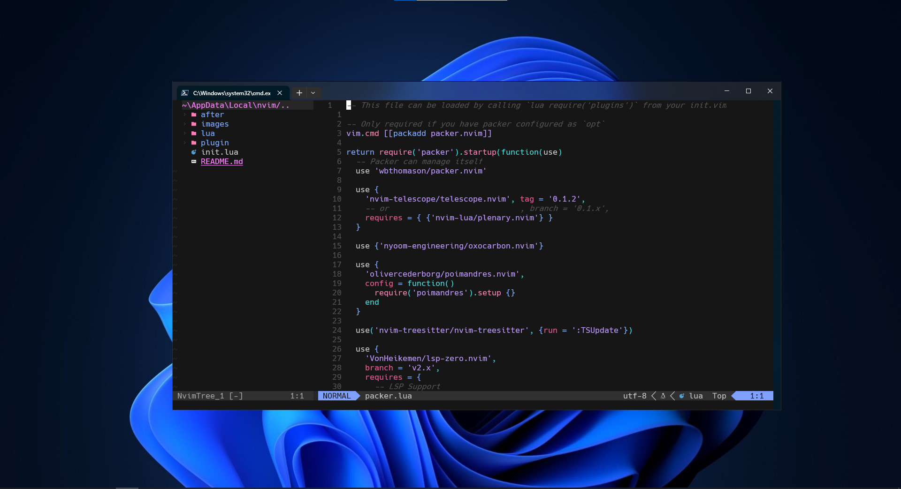
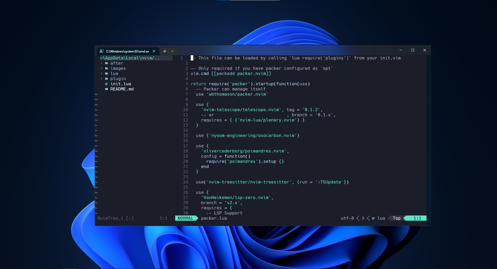

 
 

Changing themes

https://github.com/GDF97/neovim-config-lua/assets/117999512/8e967f13-878d-480a-a444-dabd5614b95c

### Neovim config

- [wbthomason/packer.nvim](https://github.com/wbthomason/packer.nvim) - A plugin manager for Neovim
- [nvim-treesitter/nvim-treesitter](https://github.com/nvim-treesitter/nvim-treesitter) - A configurations and abstraction layer for Neovim
- [nvim-telescope/telescope.nvim](https://github.com/nvim-telescope/telescope.nvim) - A Fuzzy Finder for Neovim
- [olivercederborg/poimandres.nvim](https://github.com/olivercederborg/poimandres.nvim) - A theme for Neovim
- [nyoom-engineering/oxocarbon.nvim](https://github.com/nyoom-engineering/oxocarbon.nvim) - A theme for Neovim
- [nvim-lualine/lualine.nvim](https://github.com/nvim-lualine/lualine.nvim) - Neovim statusline written in Lua
- [VonHeikemen/lsp-zero.nvim](https://github.com/VonHeikemen/lsp-zero.nvim) - LSP-Config + Mason + CMP
- [saadparwaiz1/cmp_luasnip](https://github.com/saadparwaiz1/cmp_luasnip) - Luasnip completion source for nvim-cmp
- [rafamadriz/friendly-snippets](https://github.com/rafamadriz/friendly-snippets) - Snippets collection for a set of different programming languages.
- [jose-elias-alvarez/null-ls.nvim](https://github.com/jose-elias-alvarez/null-ls.nvim) - Use Neovim as a language server to inject LSP diagnostics, code actions, and more via Lua.
- [MunifTanjim/prettier.nvim](https://github.com/MunifTanjim/prettier.nvim) - Prettier plugin for Neovim's built-in LSP client.
- [akinsho/bufferline.nvim](https://github.com/akinsho/bufferline.nvim) - A snazzy 💅 buffer line (with tabpage integration) for Neovim built using lua.
- [nvim-tree/nvim-web-devicons](https://github.com/nvim-tree/nvim-web-devicons) - A lua fork of vim-devicons. This plugin provides the same icons as well as colors for each icon.
- [nvim-tree/nvim-tree.lua](https://github.com/nvim-tree/nvim-tree.lua) - A File Explorer For Neovim Written In Lua
